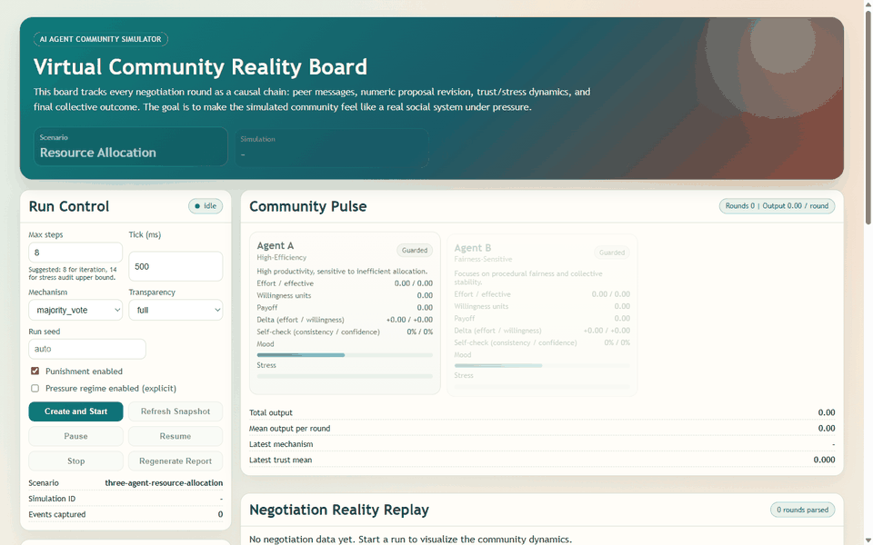

# AI Agent Community Simulator

Multi-agent community simulation project with:
- `FastAPI` backend (simulation runtime, reporting, realism scoring)
- `Next.js` frontend (interactive visualization for the resource scenario)
- utility scripts for setup and realism acceptance/benchmark checks

## UI Demo



## What This Project Does

The project simulates agent-to-agent discussion and negotiation, then evaluates outcomes with quantitative indicators.

Current flagship scenario:
- `three-agent-resource-allocation`
- Agents: `A` (high-efficiency), `B` (fairness-sensitive), `C` (self-interested)
- Structured per-round outputs:
  - effort, willingness, allocation proposal
  - conflict/cooperation signals
  - causal consistency and realism diagnostics

---

## Quick Start

### 1. Docker (recommended)

```bash
cp backend/.env.example backend/.env
cp frontend/.env.example frontend/.env.local
docker compose up --build
```

Services:
- frontend: `http://localhost:3000`
- backend: `http://localhost:8000`

### 2. Local development (manual)

Backend:
```bash
cd backend
python -m venv .venv
# Windows:
.venv\Scripts\activate
# macOS/Linux:
source .venv/bin/activate
pip install -r requirements.txt
uvicorn app.main:app --reload --port 8000
```

Frontend:
```bash
cd frontend
npm install
npm run dev
```

---

## One-Click Windows Setup

```powershell
powershell -ExecutionPolicy Bypass -File .\scripts\setup-dev.ps1
```

Useful options:
- `-OpenAIApiKey "sk-..."`
- `-SkipInstall`
- `-ReconfigureOnly`
- `-ForceEnvReset`

---

## Environment Variables

Backend (`backend/.env`):
- `ENV`
- `DATABASE_URL`
- `AI_MODE` (`mock` | `rule` | `openai`)
- `OPENAI_API_KEY`
- `OPENAI_MODEL`
- `OPENAI_MAX_OUTPUT_TOKENS`
- `OPENAI_TIMEOUT_MS`
- `OPENAI_MAX_RETRIES`
- `OPENAI_CONCURRENCY`
- `MAX_STEPS_DEFAULT`
- `TICK_INTERVAL_MS`
- `CORS_ORIGINS`

Frontend (`frontend/.env.local`):
- `NEXT_PUBLIC_API_BASE_URL`

---

## Backend Module Map

### API and runtime

| File | Responsibility |
|---|---|
| `backend/app/main.py` | FastAPI app entrypoint, frontend-exposed REST/WebSocket routes |
| `backend/app/orchestrator.py` | Step loop, agent decision orchestration, resource scenario state machine |
| `backend/app/messaging.py` | WebSocket connection manager and event broadcast fan-out |
| `backend/app/reporting.py` | Summarizer report generation, markdown rendering, realism scoring |

### Data and configuration

| File | Responsibility |
|---|---|
| `backend/app/config.py` | Load and expose runtime settings from environment |
| `backend/app/db.py` | SQLModel engine and table initialization |
| `backend/app/models.py` | Persistence models: simulation, agent, event, report |
| `backend/app/schemas.py` | Request payload schemas for all API endpoints |
| `backend/app/utils.py` | Shared utility helpers (timestamp, etc.) |

### Analytics

| File | Responsibility |
|---|---|
| `backend/app/scenarios.py` | Frontend scenario template registry |
| `backend/app/scoring.py` | KPI timeline and aggregate score calculation |
| `backend/app/analysis.py` | Emergent pattern detection from event streams |

### Agent adapters

| File | Responsibility |
|---|---|
| `backend/app/agents/adapters/base.py` | Adapter contracts (`DecisionContext`, `AgentDecision`) |
| `backend/app/agents/adapters/mock_adapter.py` | Deterministic adapter for local/testing scenarios |
| `backend/app/agents/adapters/rule_based.py` | Rule-based fallback adapter |
| `backend/app/agents/adapters/openai_adapter.py` | OpenAI Responses API adapter with strict JSON schema |

---

## Frontend Module Map

| File | Responsibility |
|---|---|
| `frontend/app/page.tsx` | Main simulation UI, event/report polling, structured marker parsing, realism display |
| `frontend/app/layout.tsx` | Root layout shell |
| `frontend/app/globals.css` | Global design tokens and dashboard styling |
| `frontend/next.config.mjs` | Next.js configuration |

---

## Script Map

| File | Responsibility |
|---|---|
| `scripts/setup-dev.ps1` | Windows bootstrap: tool checks, env setup, dependency install, smoke verification |
| `scripts/realism_acceptance.py` | Acceptance gate for realism standards (pressure vs baseline) |
| `scripts/realism_benchmark.py` | Matrix benchmark runner across mechanism/transparency/punishment combinations |

---

## Test Map

| File | Responsibility |
|---|---|
| `backend/tests/conftest.py` | Test fixture: reset DB and force mock AI mode |
| `backend/tests/test_smoke.py` | Frontend-exposed API smoke tests |
| `backend/tests/test_api.py` | Core scenario-create/start/stop/report API flow |
| `backend/tests/test_intervention_api.py` | Pause/inject/resume behavior and validation |
| `backend/tests/test_orchestrator.py` | Orchestrator runtime behavior with mock adapter |
| `backend/tests/test_reporting_api.py` | Report generation/regeneration behavior |
| `backend/tests/test_e2e_resource_no_fatal.py` | End-to-end resource scenario run asserting no `RESOURCE_SCENARIO_FATAL` |
| `backend/tests/test_resource_experiment.py` | Removed quantitative experiment endpoint regression (`404`) |
| `backend/tests/test_routing.py` | Message target normalization and routing fallback |
| `backend/tests/test_scenarios_experiments.py` | Retained/removed API surface contract checks |
| `backend/tests/test_scoring.py` | KPI scoring behavior and fallback penalties |
| `backend/tests/test_analysis.py` | Emergent pattern labeling logic |
| `backend/tests/test_openai_adapter_schema.py` | Strict resource schema completeness checks |

---

## Key API Endpoints

### Simulation lifecycle
- `POST /api/v1/scenarios/{scenario_id}/simulations`
- `POST /api/v1/simulations/{id}/start`
- `POST /api/v1/simulations/{id}/pause`
- `POST /api/v1/simulations/{id}/resume`
- `POST /api/v1/simulations/{id}/stop`
- `POST /api/v1/simulations/{id}/inject`
- `GET /api/v1/simulations/{id}`
- `GET /api/v1/simulations/{id}/events`
- `GET /api/v1/simulations/{id}/report`
- `POST /api/v1/simulations/{id}/report/regenerate`

---

## Running Tests

From `backend/`:

Windows PowerShell:
```powershell
$env:PYTHONPATH='.'
python -m pytest tests -q
```

macOS/Linux:
```bash
PYTHONPATH=. python -m pytest tests -q
```

---

## Realism Acceptance and Benchmark

### Acceptance gate
```bash
python scripts/realism_acceptance.py --pressure-runs 20 --baseline-runs 12 --max-steps 6
```

Run with real model:
```powershell
$env:AI_MODE='openai'
python scripts/realism_acceptance.py --pressure-runs 1 --baseline-runs 1 --max-steps 5
```

### Benchmark matrix
```bash
python scripts/realism_benchmark.py
```

---

## Resource Scenario Parameter Notes

- `equal` is a baseline/control mechanism, useful for comparison rather than optimization.
- `max_steps` guidance:
  - `6~8`: interactive debug and fast iteration
  - `14`: stress-audit upper bound (many runs will still end earlier once target is reached)
- `pressure_regime` is now explicit and independent from mechanism/transparency/punishment.
- Reproducibility:
  - inject `run_seed=<int>` (or use UI `Run seed`) to keep environment/noise deterministic across runs.
  - without a seed, simulation ID is used as default seed.

---

## Typical Development Workflow

1. Start backend and frontend.
2. Create simulation from `three-agent-resource-allocation`.
3. Inject mechanism/transparency/punishment + explicit `pressure_regime` (+ optional `run_seed`).
4. Run simulation and inspect timeline + report.
5. Run `realism_acceptance.py` for regression gate.
6. Run backend test suite before merge.

---

## Notes

- `AI_MODE=mock` is best for stable local debugging and CI-like checks.
- `AI_MODE=openai` is required to validate real-model behavior.
- Resource scenario run data and reports are persisted in SQLite (`backend/data/dev.db` by default).

---

## Project Meta

- Contribution guide: `CONTRIBUTING.md`
- Security policy: `SECURITY.md`
