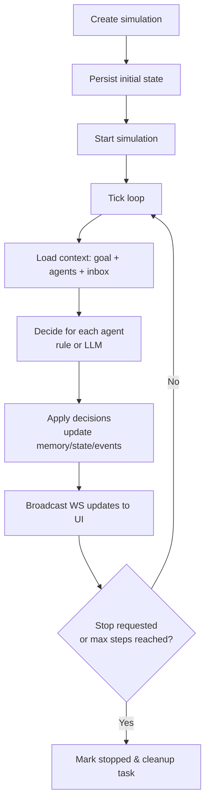

# AI Agent Community Simulator 从零到可演示的端到端开发指南

## 项目概述

我将实现一个“多智能体社区行为模拟器”：用户在网页上配置若干个 AI agent（例如：规划者、研究员、批评者、总结者），输入一个共同目标（goal），然后启动仿真；后端以离散时间步（tick）推进，每一步让每个 agent 基于自身角色、记忆（memory）与收件箱消息（inbox）做决策并发送消息；前端用实时节点—连线图展示 agent 之间的通信网络，用时间线面板展示事件流（messages/actions），从而观察“分工协作、相互纠偏、逐步收敛”的群体行为。这个项目本质上是一个多智能体系统（multi-agent system）：多个自治体在共享环境中交互并共同（或部分竞争）完成目标。citeturn15search0turn15search3turn12search2

我会以“未指定 → 推荐默认值”的方式做选择，并确保每一步都可执行、可验证、可演示。

下面两张图是我推荐的整体设计（可直接在 README 用 Mermaid 渲染）。

```mermaid
flowchart LR
  B[Browser: Next.js UI] <-- REST/JSON --> A[FastAPI REST API]
  B <-- WebSocket JSON --> W[FastAPI WebSocket]
  A --> O[Simulation Orchestrator<br/>tick loop]
  W <--> O
  O --> D[Decision Adapter<br/>(rule / OpenAI / mock)]
  D --> LLM[LLM Provider<br/>OpenAI API]
  O --> DB[(SQLite<br/>state & events)]
  O --> R[(Redis optional<br/>hot cache)]
```



## 前置条件与开发环境

### 支持的操作系统与说明

未指定 → 我默认支持并测试的开发环境为：

- Ubuntu 22.04 LTS（推荐做后端/容器开发；Docker Engine 官方支持 Jammy 22.04）。citeturn2search1  
- macOS（当前与前两代主版本；Docker Desktop 官方支持策略如此）。citeturn2search0  
- Windows 10/11（推荐安装 Docker Desktop；并用 PowerShell/Windows Terminal）。citeturn2search4turn2search8  

### 工具版本要求与推荐版本

未指定 → 我给出“推荐版本（尽量新且稳定）+ 最低可用版本（便于你不折腾也能跑）”。其中会出现少量“安装最新稳定版”的措辞：因为 Docker/VS Code 等工具版本更新快，很难在文档里长期固定到某个精确小版本，但我会标出至少需要满足的能力版本（例如 Docker Compose env_file 行为在 v2.24.0 有明确说明）。citeturn1search0turn1search6

| 工具 | 未指定时的推荐版本 | 最低可用建议 | 说明 |
|---|---:|---:|---|
| Git | 2.53.0（当前发布页所列）citeturn5search34turn5search34 | ≥ 2.30 | 版本越新对新 GitHub 工作流越友好。 |
| Node.js | v24（Active LTS）citeturn2search2 | ≥ 20 | Next.js 14+ 在较新的 LTS 上体验更稳定。citeturn1search29 |
| npm / pnpm / yarn | 未指定 → 用 npm（随 Node 安装） | — | 初学者可先只用 npm。 |
| Python | 3.13.12（Windows 下载页列为 2026-02-03 稳定发布之一）citeturn6search4turn6search0 | ≥ 3.11 | 3.13/3.14 都可；本文代码兼容 3.11+。 |
| Docker | 未指定 → 安装最新稳定版 Docker Desktop / Docker Engine | — | Docker Engine 在 Ubuntu 22.04 有官方安装路径。citeturn2search1turn2search9 |
| Docker Compose | 2.x（随 Docker Desktop/Engine 安装） | ≥ 2.24.0（建议）citeturn1search0 | env_file 行为、可选 .env 文件等特性在文档里标注到 Compose 2.24.0。 |
| VS Code（可选） | 最新稳定版 | — | 命令行 `code` 需要额外配置（macOS）。citeturn5search3turn5search7 |

### 安装与验证（按 OS分）

下面我给出**能跑通本项目**的一套安装路线。你可以只跟你所在 OS 的段落走。

#### Ubuntu 22.04 安装（推荐路线）

**安装 Git（apt 版即可）**
```bash
sudo apt update
sudo apt install -y git
git --version
```
期望输出示例（版本可能不同）：`git version 2.xx.x`。citeturn5search34turn5search2

**安装 Docker Engine + Compose（官方仓库方式）**  
我建议按 Docker 官方 Ubuntu 安装文档走（它明确支持 Ubuntu Jammy 22.04）。citeturn2search1turn2search9  
安装完成后验证：
```bash
docker --version
docker compose version
docker run --rm hello-world
```

**安装 Node.js（建议安装 LTS 主线）**  
Node.js 的版本线与 LTS 状态可在官方 releases 表查看：当前 Active LTS 是 v24。citeturn2search2  
初学者可用发行版或 nvm 安装；我推荐“版本管理器 + LTS”。（MDN 也建议先装版本管理器再装 LTS）。citeturn2search28  
验证：
```bash
node -v
npm -v
```
期望输出示例：`v24.x.x` 与 `10.x.x`（npm 版本随 Node 变化）。citeturn2search2

**安装 Python（建议 3.11+）**  
Python 官方下载页列出活跃版本线与支持周期；3.13/3.14 属于 bugfix 系列，3.11+ 满足本文。citeturn6search0  
Ubuntu 上 Python 版本管理方式很多（发行版自带 / pyenv / conda / uv 等）。未指定 → 我建议你如果不想折腾：保持系统 Python ≥ 3.11，并用虚拟环境隔离依赖（`venv` 是标准库）。citeturn6search2  
验证：
```bash
python3 --version
python3 -m venv --help >/dev/null && echo "venv OK"
```

#### macOS 安装（推荐路线）

**Git**：macOS 可通过 Xcode Command Line Tools 或 Homebrew 安装（Git 官方书也提到 Xcode CLI Tools 是常见路径）。citeturn5search2turn5search18  
验证：
```bash
git --version
```

**Docker Desktop**：按官方 macOS 安装指南安装；Docker Desktop 支持“当前 + 前两代”macOS 主版本。citeturn2search0turn2search4  
验证：
```bash
docker --version
docker compose version
```

**Node.js**：未指定 → 安装 Node.js LTS（例：v24）。可从 Node 官方下载页获取安装包。citeturn2search6turn2search2  
验证：
```bash
node -v
npm -v
```

**Python**：macOS 可用 python.org 安装包或版本管理器。本文建议 Python 3.13.12（官方 Windows 发布页也显示该版本为稳定发布之一；macOS/Linux同样可用相同版本线）。citeturn6search4turn6search0  
验证：
```bash
python3 --version
python3 -m venv --help >/dev/null && echo "venv OK"
```

**VS Code（可选）**：macOS 需要在命令面板执行 “Install 'code' command in PATH”。citeturn5search3turn5search7

#### Windows 10/11 安装（推荐路线）

**Git**：Git 官方书提到 Windows 可使用 Git for Windows 安装包。citeturn5search2turn5search34  
验证（PowerShell）：
```powershell
git --version
```

**Docker Desktop**：官方文档指出 Docker Desktop 是一键安装方案。citeturn2search4turn2search8  
验证：
```powershell
docker --version
docker compose version
```

**Node.js**：微软的 Windows Node 开发环境文档建议使用 nvm 并安装 LTS。citeturn2search12  
验证：
```powershell
node -v
npm -v
```

**Python**：Python 官方 Windows 文档提到可通过 Microsoft Store 或 python.org 安装。citeturn2search7  
如果你希望跟本文推荐版本线一致：Python.org Windows 发布页列出 Python 3.13.12（2026-02-03）。citeturn6search4  
验证：
```powershell
python --version
python -m venv --help
```

### 获取并安全管理 LLM API Key

未指定 → 我默认使用 entity["company","OpenAI","api provider"] 的 API Key，但我会把 LLM 适配层做成可插拔，所以你以后也能切换其他供应商。

关键安全原则来自 OpenAI 官方安全建议与 API reference：  
- **不要把 API key 放到浏览器端（前端）**；必须通过后端调用，避免泄露与滥用。citeturn0search2turn14search17  
- **不要提交 API key 到仓库**；要使用环境变量或秘密管理服务。citeturn0search2turn4search12  
- 推荐统一变量名 `OPENAI_API_KEY`。citeturn0search2turn0search5  

我会采用两层做法：  
1) 本地开发：`backend/.env`（不提交）  
2) CI/CD：在 Actions 的 Secrets 中配置（不写进代码）citeturn5search4turn5search8  

`backend/.env.example`（示例文件，可提交）：
```dotenv
# 后端运行环境
ENV=dev

# 未指定 -> 默认 SQLite
DATABASE_URL=sqlite:///./data/dev.db

# AI_MODE: rule | openai | mock
AI_MODE=rule

# 当 AI_MODE=openai 时需要
OPENAI_API_KEY=your_key_here
OPENAI_MODEL=gpt-4.1-mini

# 仿真默认参数
MAX_STEPS_DEFAULT=30
TICK_INTERVAL_MS=800

# 逗号分隔；开发时允许前端 origin
CORS_ORIGINS=http://localhost:3000
```
模型名示例 `gpt-4.1-mini` 来自 OpenAI 模型文档（但你可替换成更适合的模型；文档也提示复杂任务可从更强模型开始）。citeturn4search3turn4search11

根目录 `.gitignore` 必须忽略 `.env` 文件（GitHub 也建议用 `.gitignore` 忽略不应提交的文件）。citeturn7search0turn7search25  
推荐片段（我会在后文给完整版本）：
```gitignore
# env files
.env
.env.*
!.env.example
```

## 仓库初始化与项目骨架

### 创建仓库与首次提交

未指定 → 我默认仓库名 `ai-agent-community`，默认分支 `main`。

> 重要现实：仅靠 `git` 命令无法在 GitHub 平台“创建远程仓库”；你要么用网页创建，要么用 GitHub CLI（`gh`）。本文会给你“两条路”，你选更简单的。  
> 我后续所有命令都只依赖 `git` 能完成的部分。

**路线 A（最常见）：网页创建远程仓库 + 本地 push**
1) 在 GitHub 网页创建名为 `ai-agent-community` 的空仓库（不要添加 README，以免冲突）。  
2) 本地执行：
```bash
mkdir ai-agent-community
cd ai-agent-community
git init
git branch -M main
```

3) 添加远程并首次推送（把 `<YOUR_GITHUB_USERNAME>` 改成你的）：
```bash
git remote add origin https://github.com/<YOUR_GITHUB_USERNAME>/ai-agent-community.git
```

> 这里用 HTTPS 远程地址是初学者最省心的一种；实际认证可走 GitHub 的 token/credential manager，你的系统可能会弹出登录窗口。

### 创建目录结构与文件说明

我先创建一个“清晰可扩展”的 mono-repo：前后端分离，但共用一个 README、Docker Compose、CI 工作流。

在仓库根目录执行：
```bash
mkdir -p backend/app backend/tests
mkdir -p backend/app/agents/adapters
mkdir -p frontend
mkdir -p .github/workflows
```

初始树（我建议你用 `tree` 看结构；没有就 `sudo apt install tree`）：

```text
ai-agent-community/
  backend/
    app/
      agents/
        adapters/
      main.py
      config.py
      db.py
      models.py
      schemas.py
      orchestrator.py
      messaging.py
      utils.py
    tests/
    requirements.txt
    requirements-dev.txt
    Dockerfile
    .env.example
  frontend/
    (Next.js 项目稍后用 create-next-app 生成)
    Dockerfile
    .env.example
  docker-compose.yml
  .gitignore
  README.md
  LICENSE
```

每个目录的职责（我按“新手能理解、后续也好维护”的方式解释）：
- `backend/app/*`：后端业务代码（API、WebSocket、仿真引擎、LLM 适配层）。  
- `backend/tests/*`：pytest 测试。  
- `frontend/*`：前端 Next.js（UI + D3 可视化 + WebSocket 客户端）。citeturn1search29turn1search5  
- `.github/workflows/*`：GitHub Actions CI/CD 工作流；语法规则见官方文档。citeturn1search1turn1search14  

### 初始 README 模板（含 badges 占位）

GitHub 官方说明：工作流状态 badge 常见放在 README，并默认展示默认分支的最新状态。citeturn7search5  
我先给你一个“能吸引人点开”的模板（你后面只要把 badge URL 替换成你仓库生成的）：

```md
# AI Agent Community Simulator

> A lightweight multi-agent community simulation with real-time visualization (WebSocket).


## Demo
- Local: http://localhost:3000
- Backend API Docs: http://localhost:8000/docs

## What you can see
- Agents collaborate in a shared goal
- Real-time node-link graph (messages as edges)
- Timeline of events and emergent behaviors

## Quickstart (Docker)
```bash
cp backend/.env.example backend/.env
docker compose up --build
```

## Architecture
(put Mermaid diagrams here)

## Development
### Backend
```bash
cd backend
python -m venv .venv
source .venv/bin/activate
pip install -r requirements.txt -r requirements-dev.txt
uvicorn app.main:app --reload --port 8000
```

### Frontend
```bash
cd frontend
npm install
npm run dev
```

## License
MIT
```

### 创建 .gitignore（确保不提交 secrets）

GitHub Docs 说明：在仓库根创建 `.gitignore` 可让 Git 忽略不该提交的文件。citeturn7search0turn7search25  
我建议你根目录 `.gitignore` 这样写（兼容后端虚拟环境与前端 node_modules）：

```gitignore
# ===== secrets =====
.env
.env.*
!.env.example

# ===== python =====
__pycache__/
*.pyc
*.pyo
*.pyd
.venv/
venv/
.pytest_cache/
.mypy_cache/
backend/data/
*.sqlite
*.db

# ===== node =====
node_modules/
.next/
out/
dist/
frontend/.env
frontend/.env.local

# ===== OS/IDE =====
.DS_Store
Thumbs.db
.vscode/
.idea/
```

现在做第一次提交：
```bash
git add .
git commit -m "chore: init repository skeleton"
git push -u origin main
```

## 后端实现

### 技术栈选择与原因

未指定 → 我选择：Python 3.11+ + FastAPI + Uvicorn + SQLModel + SQLite（默认）+ WebSocket（FastAPI 内置）+ pytest；Redis 为可选。理由如下：

- FastAPI 原生支持 WebSocket 路由与连接断开处理（`WebSocketDisconnect`）。citeturn0search0turn7search7  
- SQLModel 与 FastAPI 配合紧密，且 SQLModel 同时基于 Pydantic 与 SQLAlchemy；FastAPI 官方“SQL 数据库”教程也给出 SQLModel 作为示例。citeturn0search4turn15search8  
- SQLModel 提供“Session 作为 FastAPI 依赖”的标准写法（`yield`）。citeturn15search2  
- Uvicorn 是 ASGI 服务器，支持 WebSocket；其 CLI 参数（如 `--reload`）有官方说明。citeturn6search7turn6search3  
- SQLite 未指定 → 默认；最适合新手本地开发与 demo（无需额外安装数据库）。SQLModel 文档对 SQLite URL 也有明确示例。citeturn0search1  

### 后端依赖安装

进入 `backend/`：
```bash
cd backend
```

创建依赖清单文件：

`backend/requirements.txt`
```txt
fastapi>=0.110
uvicorn[standard]>=0.23
sqlmodel>=0.0.16
python-dotenv>=1.0.0
pydantic>=2.0
openai>=1.0.0
httpx>=0.27.0
redis>=5.0.0
```

`backend/requirements-dev.txt`
```txt
pytest>=8.0
pytest-asyncio>=0.23
requests>=2.31
```

创建虚拟环境并安装：
```bash
python -m venv .venv
# macOS/Linux:
source .venv/bin/activate
# Windows(PowerShell):
# .venv\Scripts\Activate.ps1

pip install -U pip
pip install -r requirements.txt -r requirements-dev.txt
```

复制 env：
```bash
cp .env.example .env
```

> 注意：`.env` 不提交。OpenAI 官方明确不建议把 key 写进仓库。citeturn0search2turn4search12

### 后端代码（逐文件给出，可直接复制）

> 说明：我会把代码控制在“短但可运行”，并留出扩展点。你复制完后端文件即可运行。

#### `backend/app/utils.py`
```python
from __future__ import annotations

from datetime import datetime, timezone
from uuid import uuid4


def utcnow() -> datetime:
    return datetime.now(timezone.utc)


def uuid4_str() -> str:
    return str(uuid4())
```

#### `backend/app/config.py`
```python
from __future__ import annotations

import os
from dataclasses import dataclass
from dotenv import load_dotenv

# Load backend/.env
load_dotenv()


@dataclass(frozen=True)
class Settings:
    # Environment
    env: str = os.getenv("ENV", "dev")

    # DB: 未指定 -> 默认 SQLite 本地文件
    database_url: str = os.getenv("DATABASE_URL", "sqlite:///./data/dev.db")

    # CORS
    cors_origins: str = os.getenv("CORS_ORIGINS", "http://localhost:3000")

    # Simulation defaults
    max_steps_default: int = int(os.getenv("MAX_STEPS_DEFAULT", "30"))
    tick_interval_ms: int = int(os.getenv("TICK_INTERVAL_MS", "800"))

    # AI
    # rule | openai | mock
    ai_mode: str = os.getenv("AI_MODE", "rule").lower()

    openai_api_key: str = os.getenv("OPENAI_API_KEY", "")
    openai_model: str = os.getenv("OPENAI_MODEL", "gpt-4.1-mini")

    # Optional Redis cache
    redis_url: str = os.getenv("REDIS_URL", "").strip()


settings = Settings()
```

#### `backend/app/db.py`
（SQLModel 官方示例：用 `yield` 暴露 Session 作为 FastAPI dependency。citeturn15search2）
```python
from __future__ import annotations

import os
from sqlmodel import SQLModel, Session, create_engine

from .config import settings

# Ensure ./data exists for sqlite files
if settings.database_url.startswith("sqlite:///./"):
    os.makedirs("data", exist_ok=True)

connect_args = {}
if settings.database_url.startswith("sqlite"):
    connect_args = {"check_same_thread": False}

engine = create_engine(settings.database_url, echo=False, connect_args=connect_args)


def init_db() -> None:
    SQLModel.metadata.create_all(engine)


def get_session():
    with Session(engine) as session:
        yield session
```

#### `backend/app/models.py`
```python
from __future__ import annotations

from datetime import datetime
from enum import Enum
from typing import Any, Dict, Optional

from sqlalchemy import Column
from sqlalchemy.types import JSON
from sqlmodel import Field, SQLModel

from .utils import utcnow, uuid4_str


class SimulationStatus(str, Enum):
    created = "created"
    running = "running"
    stopping = "stopping"
    stopped = "stopped"
    error = "error"


class AgentState(str, Enum):
    idle = "idle"
    thinking = "thinking"
    acting = "acting"


class Simulation(SQLModel, table=True):
    id: str = Field(default_factory=uuid4_str, primary_key=True)
    goal: str

    status: SimulationStatus = Field(default=SimulationStatus.created)
    step: int = Field(default=0)

    max_steps: int = Field(default=30)
    tick_interval_ms: int = Field(default=800)

    created_at: datetime = Field(default_factory=utcnow)
    updated_at: datetime = Field(default_factory=utcnow)


class Agent(SQLModel, table=True):
    id: str = Field(default_factory=uuid4_str, primary_key=True)
    simulation_id: str = Field(foreign_key="simulation.id", index=True)

    name: str
    role: str
    state: AgentState = Field(default=AgentState.idle)

    # Memory is JSON; SQLite will store as text under the hood.
    memory: Dict[str, Any] = Field(
        default_factory=dict,
        sa_column=Column(JSON),
    )

    last_action: str = Field(default="")
    last_message: str = Field(default="")

    # Optional coordinates (frontend can ignore)
    x: float = Field(default=0.0)
    y: float = Field(default=0.0)


class Event(SQLModel, table=True):
    id: str = Field(default_factory=uuid4_str, primary_key=True)
    simulation_id: str = Field(foreign_key="simulation.id", index=True)

    step: int = Field(index=True)
    ts: datetime = Field(default_factory=utcnow)

    # message | action | status
    type: str = Field(index=True)

    from_agent_id: Optional[str] = Field(default=None, index=True)
    to_agent_id: Optional[str] = Field(default=None, index=True)

    content: str = Field(default="")
    payload: Dict[str, Any] = Field(default_factory=dict, sa_column=Column(JSON))
```

#### `backend/app/schemas.py`
```python
from __future__ import annotations

from datetime import datetime
from typing import Any, Dict, List, Optional

from pydantic import BaseModel, Field as PField


class AgentCreate(BaseModel):
    name: str = PField(min_length=1, max_length=32)
    role: str = PField(min_length=1, max_length=32)


class SimulationCreate(BaseModel):
    goal: str = PField(min_length=1, max_length=500)
    max_steps: int = PField(default=30, ge=1, le=500)
    tick_interval_ms: int = PField(default=800, ge=100, le=10_000)
    agents: List[AgentCreate] = PField(min_length=1, max_length=20)


class SimulationOut(BaseModel):
    id: str
    goal: str
    status: str
    step: int
    max_steps: int
    tick_interval_ms: int
    created_at: datetime
    updated_at: datetime


class AgentOut(BaseModel):
    id: str
    simulation_id: str
    name: str
    role: str
    state: str
    memory: Dict[str, Any]
    last_action: str
    last_message: str


class EventOut(BaseModel):
    id: str
    simulation_id: str
    step: int
    ts: datetime
    type: str
    from_agent_id: Optional[str]
    to_agent_id: Optional[str]
    content: str
    payload: Dict[str, Any]


class StartResponse(BaseModel):
    simulation: SimulationOut
    agents: List[AgentOut]


class StopResponse(BaseModel):
    simulation_id: str
    status: str
```

#### `backend/app/messaging.py`
（广播思路参考 FastAPI WebSocket 文档对多客户端与断开处理的示例。citeturn0search0turn7search7）
```python
from __future__ import annotations

import asyncio
from collections import defaultdict
from typing import Any, Dict, Set

from fastapi import WebSocket


class ConnectionManager:
    def __init__(self) -> None:
        self._lock = asyncio.Lock()
        self._connections: Dict[str, Set[WebSocket]] = defaultdict(set)

    async def connect(self, simulation_id: str, websocket: WebSocket) -> None:
        await websocket.accept()
        async with self._lock:
            self._connections[simulation_id].add(websocket)

    async def disconnect(self, simulation_id: str, websocket: WebSocket) -> None:
        async with self._lock:
            if websocket in self._connections[simulation_id]:
                self._connections[simulation_id].remove(websocket)

    async def broadcast(self, simulation_id: str, message: Dict[str, Any]) -> None:
        # Copy to avoid concurrent modification
        async with self._lock:
            conns = list(self._connections[simulation_id])

        dead: list[WebSocket] = []
        for ws in conns:
            try:
                await ws.send_json(message)
            except Exception:
                dead.append(ws)

        # Clean up dead connections
        if dead:
            async with self._lock:
                for ws in dead:
                    self._connections[simulation_id].discard(ws)
```

#### `backend/app/agents/core.py`
```python
from __future__ import annotations

from dataclasses import dataclass
from typing import Any, Dict, List, Optional


ROLE_HINTS: dict[str, str] = {
    "planner": "负责拆解目标、分配任务、推动收敛。",
    "researcher": "负责提出事实、例子、方案备选。",
    "critic": "负责找风险、指出漏洞、提出约束。",
    "writer": "负责把当前进展整理成清晰的输出。",
    "mediator": "负责协调冲突、统一口径。",
}


@dataclass
class InboxMessage:
    from_agent_id: str
    content: str


@dataclass
class AgentDirectoryEntry:
    agent_id: str
    name: str
    role: str


@dataclass
class DecisionContext:
    simulation_id: str
    step: int
    goal: str
    agent_id: str
    agent_name: str
    agent_role: str
    memory: Dict[str, Any]
    inbox: List[InboxMessage]
    directory: List[AgentDirectoryEntry]


@dataclass
class AgentDecision:
    # idle | thinking | acting
    state: str
    action: str  # "message" | "note" | "idle"
    to_agent_id: Optional[str]
    message: Optional[str]
    memory_append: List[str]
```

#### `backend/app/agents/adapters/base.py`
```python
from __future__ import annotations

from abc import ABC, abstractmethod
from ..core import AgentDecision, DecisionContext


class DecisionAdapter(ABC):
    @abstractmethod
    async def decide(self, ctx: DecisionContext) -> AgentDecision:
        raise NotImplementedError
```

#### `backend/app/agents/adapters/rule_based.py`
```python
from __future__ import annotations

from typing import Optional

from ..core import AgentDecision, DecisionContext, ROLE_HINTS


def _find_agent_by_role(ctx: DecisionContext, role: str) -> Optional[str]:
    for a in ctx.directory:
        if a.role == role:
            return a.agent_id
    return None


class RuleBasedDecisionAdapter:
    async def decide(self, ctx: DecisionContext) -> AgentDecision:
        # Basic discipline: respond to inbox first
        if ctx.inbox:
            last = ctx.inbox[-1]
            # Simple role-style responses
            if ctx.agent_role == "researcher":
                reply = f"我补充 2 个可行点：1) 将目标拆成小步骤；2) 先产出最小可演示版本。"
            elif ctx.agent_role == "critic":
                reply = f"我看到 2 个风险：1) 规则过少会无聊；2) LLM 成本不可控。建议加 mock 模式 + token 限制。"
            elif ctx.agent_role == "writer":
                reply = f"我可以把当前讨论整理成 5 行结论，方便最终展示。"
            else:
                reply = "收到。我会基于当前目标继续推进。"

            return AgentDecision(
                state="acting",
                action="message",
                to_agent_id=last.from_agent_id,
                message=reply,
                memory_append=[f"responded_to:{last.from_agent_id}"],
            )

        # No inbox: act by role and step
        planner_id = _find_agent_by_role(ctx, "planner")

        if ctx.step == 0 and ctx.agent_role == "planner":
            to_ids = [a.agent_id for a in ctx.directory if a.agent_id != ctx.agent_id]
            # Broadcast sequentially: orchestrator will send per tick; here we send to 1st agent for simplicity
            first = to_ids[0] if to_ids else None
            msg = "大家好。请各自从角色视角给出：1) 你建议的子任务；2) 你最担心的失败点。"
            return AgentDecision(
                state="acting",
                action="message",
                to_agent_id=first,
                message=msg,
                memory_append=["kickoff:asked_team"],
            )

        if ctx.agent_role == "planner" and ctx.step in (1, 2):
            # Prompt next agent to contribute
            for a in ctx.directory:
                if a.agent_id != ctx.agent_id:
                    return AgentDecision(
                        state="acting",
                        action="message",
                        to_agent_id=a.agent_id,
                        message="请继续补充一个具体可落地的建议（用一句话）。",
                        memory_append=[f"nudge:{a.agent_id}"],
                    )

        # Default: keep a note
        hint = ROLE_HINTS.get(ctx.agent_role, "保持推进。")
        return AgentDecision(
            state="thinking",
            action="note",
            to_agent_id=planner_id if (planner_id and ctx.agent_role != "planner") else None,
            message=f"（自我备注）{hint}",
            memory_append=[f"note:step{ctx.step}"],
        )
```

#### `backend/app/agents/adapters/mock_adapter.py`
```python
from __future__ import annotations

from ..core import AgentDecision, DecisionContext


class MockDecisionAdapter:
    async def decide(self, ctx: DecisionContext) -> AgentDecision:
        # Deterministic, offline-friendly behavior for tests/demos
        if ctx.step == 0:
            return AgentDecision(
                state="acting",
                action="note",
                to_agent_id=None,
                message=f"mock:init:{ctx.agent_role}",
                memory_append=[f"mock:init:{ctx.agent_role}"],
            )
        return AgentDecision(
            state="idle",
            action="idle",
            to_agent_id=None,
            message=None,
            memory_append=[],
        )
```

#### `backend/app/agents/adapters/openai_adapter.py`
这部分遵循 OpenAI 官方建议：使用环境变量管理 key、后端调用、遇到 429 用指数退避重试。citeturn14search17turn0search2turn4search2turn4search6  
并使用“Structured Outputs（json_schema）”约束模型输出为可解析 JSON。citeturn11view0turn11view1

```python
from __future__ import annotations

import asyncio
import json
import random
from typing import Any, Dict

from openai import OpenAI
from ..core import AgentDecision, DecisionContext
from ...config import settings

# A strict JSON schema for decisions
DECISION_SCHEMA: Dict[str, Any] = {
    "name": "agent_decision",
    "schema": {
        "type": "object",
        "properties": {
            "state": {"type": "string", "enum": ["idle", "thinking", "acting"]},
            "action": {"type": "string", "enum": ["message", "note", "idle"]},
            "to_agent_id": {"type": ["string", "null"]},
            "message": {"type": ["string", "null"]},
            "memory_append": {
                "type": "array",
                "items": {"type": "string"},
                "maxItems": 5,
            },
        },
        "required": ["state", "action", "to_agent_id", "message", "memory_append"],
        "additionalProperties": False,
    },
    "strict": True,
}


class OpenAIDecisionAdapter:
    def __init__(self) -> None:
        if not settings.openai_api_key:
            raise RuntimeError("OPENAI_API_KEY is required for AI_MODE=openai")
        self._client = OpenAI(api_key=settings.openai_api_key)
        self._sem = asyncio.Semaphore(2)  # simple concurrency cap

    def _build_prompt(self, ctx: DecisionContext) -> str:
        inbox = [{"from": m.from_agent_id, "content": m.content} for m in ctx.inbox]
        directory = [{"id": a.agent_id, "name": a.name, "role": a.role} for a in ctx.directory]
        return (
            "You are an agent participating in a multi-agent simulation.\n"
            "Return ONLY a JSON object that matches the provided schema.\n\n"
            f"GOAL: {ctx.goal}\n"
            f"STEP: {ctx.step}\n"
            f"YOU: id={ctx.agent_id} name={ctx.agent_name} role={ctx.agent_role}\n"
            f"YOUR_MEMORY: {json.dumps(ctx.memory, ensure_ascii=False)[:2000]}\n"
            f"INBOX: {json.dumps(inbox, ensure_ascii=False)[:2000]}\n"
            f"DIRECTORY: {json.dumps(directory, ensure_ascii=False)[:2000]}\n\n"
            "Decision rules:\n"
            "- Keep output concise.\n"
            "- Prefer messaging ONLY when it helps coordination.\n"
            "- If no useful action, choose action=idle.\n"
        )

    async def decide(self, ctx: DecisionContext) -> AgentDecision:
        prompt = self._build_prompt(ctx)

        # Exponential backoff on transient errors / 429 is recommended by OpenAI.citeturn4search2turn4search10
        max_retries = 5
        base_delay = 0.5

        async with self._sem:
            for attempt in range(max_retries):
                try:
                    # Call in a thread to avoid blocking the event loop
                    resp = await asyncio.to_thread(
                        self._client.chat.completions.create,
                        model=settings.openai_model,
                        messages=[
                            {"role": "system", "content": "You are a concise, deterministic agent."},
                            {"role": "user", "content": prompt},
                        ],
                        response_format={
                            "type": "json_schema",
                            "json_schema": DECISION_SCHEMA,
                        },
                        temperature=0,
                        max_tokens=300,
                    )
                    content = resp.choices[0].message.content or "{}"
                    obj = json.loads(content)

                    return AgentDecision(
                        state=obj["state"],
                        action=obj["action"],
                        to_agent_id=obj["to_agent_id"],
                        message=obj["message"],
                        memory_append=obj["memory_append"],
                    )
                except Exception as e:
                    # Backoff with jitter
                    if attempt == max_retries - 1:
                        raise
                    delay = base_delay * (2 ** attempt) + random.random() * 0.25
                    await asyncio.sleep(delay)
```

> 备注：OpenAI Structured Outputs 的 `response_format: {type: "json_schema", json_schema: {..., strict:true}}` 用法与示例来自官方指南。citeturn11view0turn11view1turn4search1

#### `backend/app/orchestrator.py`
```python
from __future__ import annotations

import asyncio
import logging
from typing import Dict, List, Optional, Tuple

from sqlmodel import Session, select

from .config import settings
from .models import Agent, AgentState, Event, Simulation, SimulationStatus
from .messaging import ConnectionManager
from .agents.core import AgentDecision, DecisionContext, InboxMessage, AgentDirectoryEntry
from .agents.adapters.rule_based import RuleBasedDecisionAdapter
from .agents.adapters.mock_adapter import MockDecisionAdapter
from .agents.adapters.openai_adapter import OpenAIDecisionAdapter
from .utils import utcnow

logger = logging.getLogger(__name__)


def _pick_adapter():
    if settings.ai_mode == "mock":
        return MockDecisionAdapter()
    if settings.ai_mode == "openai":
        return OpenAIDecisionAdapter()
    return RuleBasedDecisionAdapter()


class Orchestrator:
    def __init__(self, ws: ConnectionManager) -> None:
        self._ws = ws
        self._tasks: Dict[str, asyncio.Task] = {}
        self._stop_flags: Dict[str, asyncio.Event] = {}

    def is_running(self, simulation_id: str) -> bool:
        task = self._tasks.get(simulation_id)
        return bool(task and not task.done())

    async def start(self, simulation_id: str, engine_session_factory) -> None:
        if self.is_running(simulation_id):
            return
        stop_event = asyncio.Event()
        self._stop_flags[simulation_id] = stop_event
        task = asyncio.create_task(self._run(simulation_id, stop_event, engine_session_factory))
        self._tasks[simulation_id] = task

    async def stop(self, simulation_id: str) -> None:
        ev = self._stop_flags.get(simulation_id)
        if ev:
            ev.set()
        task = self._tasks.get(simulation_id)
        if task:
            task.cancel()

    async def _run(self, simulation_id: str, stop_event: asyncio.Event, engine_session_factory) -> None:
        adapter = _pick_adapter()
        logger.info("orchestrator start sim=%s ai_mode=%s", simulation_id, settings.ai_mode)

        try:
            while not stop_event.is_set():
                # Load simulation & agents
                with engine_session_factory() as session:
                    sim = session.get(Simulation, simulation_id)
                    if not sim:
                        return

                    if sim.status != SimulationStatus.running:
                        # If not running, exit gracefully
                        return

                    if sim.step >= sim.max_steps:
                        sim.status = SimulationStatus.stopped
                        sim.updated_at = utcnow()
                        session.add(sim)
                        session.commit()
                        await self._ws.broadcast(simulation_id, {
                            "type": "simulation.status",
                            "simulation_id": simulation_id,
                            "status": sim.status,
                            "step": sim.step,
                        })
                        return

                    agents = session.exec(select(Agent).where(Agent.simulation_id == simulation_id)).all()

                    # Build directory
                    directory = [
                        AgentDirectoryEntry(agent_id=a.id, name=a.name, role=a.role)
                        for a in agents
                    ]

                    # Inbox comes from previous step events
                    inbox_by_agent = self._load_inbox(session, simulation_id, sim.step)

                    next_step = sim.step + 1

                    # Decide per agent
                    decisions: List[Tuple[Agent, AgentDecision]] = []
                    for a in agents:
                        inbox = inbox_by_agent.get(a.id, [])
                        ctx = DecisionContext(
                            simulation_id=simulation_id,
                            step=sim.step,
                            goal=sim.goal,
                            agent_id=a.id,
                            agent_name=a.name,
                            agent_role=a.role,
                            memory=a.memory or {},
                            inbox=inbox,
                            directory=directory,
                        )
                        a.state = AgentState.thinking
                        session.add(a)
                        decisions.append((a, await adapter.decide(ctx)))

                    # Apply decisions & persist events
                    for a, d in decisions:
                        await self._apply_decision(session, sim, a, d, next_step)

                    # Advance simulation step
                    sim.step = next_step
                    sim.updated_at = utcnow()
                    session.add(sim)
                    session.commit()

                    # Broadcast snapshot tick
                    await self._ws.broadcast(simulation_id, {
                        "type": "tick",
                        "simulation_id": simulation_id,
                        "step": sim.step,
                    })

                await asyncio.sleep(sim.tick_interval_ms / 1000.0)

        except asyncio.CancelledError:
            logger.info("orchestrator cancelled sim=%s", simulation_id)
        except Exception as e:
            logger.exception("orchestrator error sim=%s err=%s", simulation_id, e)
            with engine_session_factory() as session:
                sim = session.get(Simulation, simulation_id)
                if sim:
                    sim.status = SimulationStatus.error
                    sim.updated_at = utcnow()
                    session.add(sim)
                    session.commit()
            await self._ws.broadcast(simulation_id, {
                "type": "simulation.status",
                "simulation_id": simulation_id,
                "status": "error",
            })
        finally:
            logger.info("orchestrator end sim=%s", simulation_id)

    def _load_inbox(self, session: Session, simulation_id: str, prev_step: int):
        stmt = select(Event).where(
            Event.simulation_id == simulation_id,
            Event.step == prev_step,
            Event.type == "message",
        )
        events = session.exec(stmt).all()
        inbox: Dict[str, List[InboxMessage]] = {}
        for ev in events:
            if ev.to_agent_id:
                inbox.setdefault(ev.to_agent_id, []).append(
                    InboxMessage(from_agent_id=ev.from_agent_id or "", content=ev.content)
                )
        return inbox

    async def _apply_decision(self, session: Session, sim: Simulation, agent: Agent, d: AgentDecision, step: int) -> None:
        agent.state = AgentState(d.state)
        agent.last_action = d.action
        agent.last_message = d.message or ""

        # Update memory
        mem = agent.memory or {}
        history = mem.get("history", [])
        if isinstance(history, list):
            history.extend(d.memory_append)
            # trim
            mem["history"] = history[-50:]
        agent.memory = mem

        session.add(agent)

        # Persist event(s)
        if d.action in ("message", "note"):
            ev_type = "message" if d.action == "message" else "action"
            ev = Event(
                simulation_id=sim.id,
                step=step,
                type=ev_type,
                from_agent_id=agent.id,
                to_agent_id=d.to_agent_id,
                content=d.message or "",
                payload={
                    "action": d.action,
                    "state": d.state,
                },
            )
            session.add(ev)

            # Broadcast event + agent update (real-time)
            await self._ws.broadcast(sim.id, {
                "type": "event",
                "event": {
                    "id": ev.id,
                    "simulation_id": sim.id,
                    "step": step,
                    "type": ev_type,
                    "from_agent_id": agent.id,
                    "to_agent_id": d.to_agent_id,
                    "content": d.message,
                    "payload": ev.payload,
                }
            })

        await self._ws.broadcast(sim.id, {
            "type": "agent.update",
            "simulation_id": sim.id,
            "step": step,
            "agent": {
                "id": agent.id,
                "name": agent.name,
                "role": agent.role,
                "state": agent.state,
                "last_action": agent.last_action,
                "last_message": agent.last_message,
                "memory": agent.memory,
            }
        })
```

#### `backend/app/main.py`
FastAPI WebSocket 路由写法与断开处理见官方文档。citeturn7search7turn0search0  
另外，前后端不同 origin 时需要 CORS；FastAPI 提供 CORSMiddleware 教程。citeturn7search2

```python
from __future__ import annotations

import logging
from typing import List

from fastapi import Depends, FastAPI, HTTPException, WebSocket, WebSocketDisconnect
from fastapi.middleware.cors import CORSMiddleware
from sqlmodel import Session, select

from .config import settings
from .db import get_session, init_db, engine
from .models import Agent, Event, Simulation, SimulationStatus
from .schemas import (
    AgentOut,
    SimulationCreate,
    SimulationOut,
    StartResponse,
    StopResponse,
    EventOut,
)
from .messaging import ConnectionManager
from .orchestrator import Orchestrator

logging.basicConfig(level=logging.INFO)
logger = logging.getLogger("app")

app = FastAPI(title="AI Agent Community Simulator", version="0.1.0")

# CORS (dev-friendly defaults)
origins = [o.strip() for o in settings.cors_origins.split(",") if o.strip()]
app.add_middleware(
    CORSMiddleware,
    allow_origins=origins if origins else ["*"],
    allow_credentials=True,
    allow_methods=["*"],
    allow_headers=["*"],
)

ws_manager = ConnectionManager()
orchestrator = Orchestrator(ws_manager)


@app.on_event("startup")
def _startup():
    init_db()
    logger.info("startup ok db=%s ai_mode=%s", settings.database_url, settings.ai_mode)


@app.get("/health")
def health():
    return {"ok": True}


@app.post("/api/v1/simulations", response_model=StartResponse)
def create_simulation(payload: SimulationCreate, session: Session = Depends(get_session)):
    sim = Simulation(
        goal=payload.goal,
        status=SimulationStatus.created,
        step=0,
        max_steps=payload.max_steps,
        tick_interval_ms=payload.tick_interval_ms,
    )
    session.add(sim)
    session.commit()
    session.refresh(sim)

    agents: List[Agent] = []
    for a in payload.agents:
        agent = Agent(
            simulation_id=sim.id,
            name=a.name,
            role=a.role,
            memory={"history": [], "role": a.role},
        )
        session.add(agent)
        agents.append(agent)

    session.commit()
    for agent in agents:
        session.refresh(agent)

    return {
        "simulation": sim,
        "agents": agents,
    }


@app.post("/api/v1/simulations/{simulation_id}/start", response_model=SimulationOut)
async def start_simulation(simulation_id: str, session: Session = Depends(get_session)):
    sim = session.get(Simulation, simulation_id)
    if not sim:
        raise HTTPException(status_code=404, detail="simulation not found")

    if sim.status == SimulationStatus.running:
        return sim

    sim.status = SimulationStatus.running
    session.add(sim)
    session.commit()
    session.refresh(sim)

    # session factory for orchestrator
    def session_factory():
        return Session(engine)

    await orchestrator.start(simulation_id, session_factory)
    return sim


@app.post("/api/v1/simulations/{simulation_id}/stop", response_model=StopResponse)
async def stop_simulation(simulation_id: str, session: Session = Depends(get_session)):
    sim = session.get(Simulation, simulation_id)
    if not sim:
        raise HTTPException(status_code=404, detail="simulation not found")

    sim.status = SimulationStatus.stopping
    session.add(sim)
    session.commit()

    await orchestrator.stop(simulation_id)

    sim.status = SimulationStatus.stopped
    session.add(sim)
    session.commit()

    return {"simulation_id": simulation_id, "status": sim.status}


@app.get("/api/v1/simulations/{simulation_id}", response_model=SimulationOut)
def get_simulation(simulation_id: str, session: Session = Depends(get_session)):
    sim = session.get(Simulation, simulation_id)
    if not sim:
        raise HTTPException(status_code=404, detail="simulation not found")
    return sim


@app.get("/api/v1/simulations/{simulation_id}/agents", response_model=list[AgentOut])
def list_agents(simulation_id: str, session: Session = Depends(get_session)):
    agents = session.exec(select(Agent).where(Agent.simulation_id == simulation_id)).all()
    return agents


@app.get("/api/v1/simulations/{simulation_id}/events", response_model=list[EventOut])
def list_events(simulation_id: str, limit: int = 200, session: Session = Depends(get_session)):
    stmt = (
        select(Event)
        .where(Event.simulation_id == simulation_id)
        .order_by(Event.step.desc(), Event.ts.desc())
        .limit(min(limit, 500))
    )
    events = session.exec(stmt).all()
    # reverse to chronological
    return list(reversed(events))


@app.websocket("/ws/simulations/{simulation_id}")
async def ws_simulation(websocket: WebSocket, simulation_id: str):
    await ws_manager.connect(simulation_id, websocket)
    try:
        # Keep connection alive; client can also send "ping"
        while True:
            _ = await websocket.receive_text()
    except WebSocketDisconnect:
        await ws_manager.disconnect(simulation_id, websocket)
```

> 说明：FastAPI 默认的 OpenAPI 文档（`/docs`）不会自动展示 WebSocket 路由，这是社区常见问题之一（HTTP 与 WS 不同协议）。你需要用“消息 schema 文档”来补足 WS 协议说明。citeturn0search6

### 本地运行后端（含预期输出）

进入 `backend/` 并激活虚拟环境后：

```bash
uvicorn app.main:app --reload --port 8000
```
Uvicorn CLI 的 `--reload` 用法与说明见官方文档。citeturn6search11turn6search3

预期日志大致如下（会略有差异）：
```text
INFO:     Uvicorn running on http://127.0.0.1:8000
INFO:app: startup ok db=sqlite:///./data/dev.db ai_mode=rule
```

打开：
- `http://localhost:8000/docs`：查看 REST API（FastAPI 会自动生成 Swagger UI）。  
- `http://localhost:8000/health`：看到 `{"ok": true}`。

### 用 curl 测试后端（可复制）

**创建 simulation**
```bash
curl -s http://localhost:8000/api/v1/simulations \
  -H "Content-Type: application/json" \
  -d '{
    "goal":"为初学者做一个可演示的多智能体社区模拟器",
    "max_steps":10,
    "tick_interval_ms":800,
    "agents":[
      {"name":"Planner","role":"planner"},
      {"name":"Researcher","role":"researcher"},
      {"name":"Critic","role":"critic"},
      {"name":"Writer","role":"writer"}
    ]
  }'
```

你会得到一个 `simulation.id`（uuid 字符串）。然后启动：

```bash
curl -s -X POST http://localhost:8000/api/v1/simulations/<SIM_ID>/start
```

停止：
```bash
curl -s -X POST http://localhost:8000/api/v1/simulations/<SIM_ID>/stop
```

## AI 决策函数与成本控制

### 可插拔设计（rule / OpenAI / mock）

我在后端用 `DecisionAdapter` 接口把“决策”从“仿真调度”里解耦。这样做的价值是：

- 你可以离线演示（mock）而不花 API 钱。  
- 你可以在同一个 UI 下对比 rule-based 与 LLM-based 的差异（这是很强的作品展示点）。  
- 测试更容易：mock 决策可确保稳定、可重复。  

这符合多智能体系统里常见的工程实践：把“控制器/调度器（orchestrator）”与“策略（policy）”分离。citeturn15search3turn12search2

### WebSocket 消息协议（schema + 示例）

因为 WebSocket 不在 `/docs` 里自动生成文档（前面已说明），我会在 README 明确 WS 消息 schema。citeturn0search6  
未指定 → 我采用统一 envelope：`type` + payload。

**消息类型一览（建议写进 README）**

| type | 含义 | 关键字段 |
|---|---|---|
| `tick` | 推进到某个 step | `simulation_id`, `step` |
| `agent.update` | 某个 agent 状态更新 | `agent: {id,name,role,state,last_action,last_message,memory}` |
| `event` | 新事件（message/action） | `event: {step,type,from_agent_id,to_agent_id,content}` |
| `simulation.status` | simulation 状态变化 | `status`, `step` |

**示例：agent.update**
```json
{
  "type": "agent.update",
  "simulation_id": "sim-uuid",
  "step": 2,
  "agent": {
    "id": "agent-uuid",
    "name": "Planner",
    "role": "planner",
    "state": "acting",
    "last_action": "message",
    "last_message": "请继续补充一个具体可落地的建议（用一句话）。",
    "memory": { "history": ["kickoff:asked_team"] }
  }
}
```

**示例：event（message）**
```json
{
  "type": "event",
  "event": {
    "id": "event-uuid",
    "simulation_id": "sim-uuid",
    "step": 2,
    "type": "message",
    "from_agent_id": "agentA",
    "to_agent_id": "agentB",
    "content": "我看到 2 个风险：1) ... 2) ...",
    "payload": { "action": "message", "state": "acting" }
  }
}
```

### Prompt 模板（决策 + agent-to-agent 消息）

我会把 prompt 控制为：短、明确、强约束 JSON 输出，并把上下文限制到必要信息（goal / step / inbox / directory / memory摘要），以降低成本与漂移。

**决策 prompt（概念模板）**  
（我在代码中已经实现 `_build_prompt`，这里解释结构）
- 系统约束：`Return ONLY JSON matching schema`  
- 上下文：goal、step、agent 自身、目录、inbox、memory（截断）  
- 决策规则：优先协作消息，否则 idle；输出简短

**Determinism 小技巧（以工程角度理解）**
- `temperature=0` 让输出更趋确定性（并配合 schema 约束）。citeturn11view1  
- 输出用 `json_schema` 强约束，减少“看似 JSON 但不可解析”的问题；OpenAI 官方建议“尽量用 Structured Outputs 而不是 JSON mode”。citeturn9view0turn11view1  

### OpenAI 接入方式与重试/限流

OpenAI 官方文档强调：API key 通过环境变量加载、后端调用、HTTP Bearer 认证。citeturn14search17turn4search12turn0search2  
当遇到 429（Too Many Requests）时，官方建议指数退避重试。citeturn4search2turn4search6turn4search10  

我在 `OpenAIDecisionAdapter` 中实现了：
- 简单并发上限（Semaphore=2）  
- 最多 5 次重试  
- 指数退避 + jitter  

### 成本控制策略（建议写进 README 的“Cost”章节）

你在 demo 期最容易踩坑的是“仿真 tick 太频繁 + agent 太多 + 每步都调用 LLM”。我建议你把成本控制写成可配置项：

1) **Mock 模式**：`AI_MODE=mock`（完全离线，0 成本）  
2) **Rule 模式**：`AI_MODE=rule`（仍离线，但更像“有行为”）  
3) **LLM 模式**：`AI_MODE=openai` 并对调用做硬限制：  
   - Max steps（例如 30）  
   - Tick interval（例如 800ms–1500ms）  
   - `max_tokens`（例如 300）  
4) **缓存**：对“相同上下文”决策结果做缓存（key=hash(goal+step+agent_role+inbox摘要+memory摘要)），命中直接复用。  
5) **批处理**（进阶）：把同一步里多个 agent 的决策合并为一次模型调用（返回数组），减少请求次数（会增加 prompt 复杂度，未指定 → 我默认不做）。  
定价与 token 计费可参考 OpenAI 官方 API pricing 页面。citeturn4search19  

## 前端实现

### 技术栈选择与原因

未指定 → 我选择：Next.js（App Router）+ TypeScript + Tailwind CSS + D3 force simulation + 浏览器原生 WebSocket。原因：

- Next.js 官方文档提供 App Router 项目结构与 create-next-app 一键初始化方式。citeturn1search29turn1search5  
- Tailwind 提供 Next.js 官方安装指南（create-next-app 默认也常带 Tailwind）。citeturn3search4turn3search11  
- D3 的 `d3-force` 专门用于网络图（nodes/links）布局，官方文档明确其用于可视化网络结构并在 tick 事件中更新渲染。citeturn3search5turn3search1  

### 初始化前端（从零开始）

进入仓库根目录：

```bash
cd ai-agent-community
```

用 create-next-app 初始化（Next.js 文档给出 `npx create-next-app@latest` 的标准方式）。citeturn1search5turn3search11  

```bash
npx create-next-app@latest frontend --yes
```

> `--yes` 会使用默认偏好（通常包含 TypeScript、ESLint、Tailwind、App Router 等）。citeturn3search11

安装 D3：
```bash
cd frontend
npm install d3
```

创建前端 env 示例：`frontend/.env.example`
```dotenv
# 浏览器端会用到的变量必须以 NEXT_PUBLIC_ 开头
NEXT_PUBLIC_API_BASE_URL=http://localhost:8000
```

> 我不会要求你把 API base 写死；代码里会给默认值，方便 Docker/本地同时跑。

### 前端关键文件（可直接复制）

#### `frontend/app/page.tsx`
```tsx
"use client";

import { useMemo, useState } from "react";
import Controls, { AgentDraft } from "./components/Controls";
import SimulatorView from "./components/SimulatorView";

const API_BASE =
  process.env.NEXT_PUBLIC_API_BASE_URL ?? "http://localhost:8000";

export default function Page() {
  const [goal, setGoal] = useState(
    "为初学者做一个可演示的多智能体社区模拟器"
  );
  const [tickIntervalMs, setTickIntervalMs] = useState(800);
  const [maxSteps, setMaxSteps] = useState(12);

  const [agents, setAgents] = useState<AgentDraft[]>([
    { name: "Planner", role: "planner" },
    { name: "Researcher", role: "researcher" },
    { name: "Critic", role: "critic" },
    { name: "Writer", role: "writer" },
  ]);

  const [simulationId, setSimulationId] = useState<string | null>(null);

  const wsUrl = useMemo(() => {
    if (!simulationId) return null;
    const base = API_BASE.replace("http://", "ws://").replace("https://", "wss://");
    return `${base}/ws/simulations/${simulationId}`;
  }, [simulationId]);

  async function handleCreateAndStart() {
    const resp = await fetch(`${API_BASE}/api/v1/simulations`, {
      method: "POST",
      headers: { "Content-Type": "application/json" },
      body: JSON.stringify({ goal, max_steps: maxSteps, tick_interval_ms: tickIntervalMs, agents }),
    });

    if (!resp.ok) {
      const txt = await resp.text();
      alert(`Create failed: ${resp.status} ${txt}`);
      return;
    }

    const data = await resp.json();
    const simId = data.simulation.id as string;

    const startResp = await fetch(`${API_BASE}/api/v1/simulations/${simId}/start`, {
      method: "POST",
    });
    if (!startResp.ok) {
      const txt = await startResp.text();
      alert(`Start failed: ${startResp.status} ${txt}`);
      return;
    }

    setSimulationId(simId);
  }

  async function handleStop() {
    if (!simulationId) return;
    await fetch(`${API_BASE}/api/v1/simulations/${simulationId}/stop`, {
      method: "POST",
    });
    setSimulationId(null);
  }

  return (
    <main className="min-h-screen p-6">
      <div className="mx-auto max-w-6xl space-y-6">
        <header className="space-y-1">
          <h1 className="text-2xl font-semibold">AI Agent Community Simulator</h1>
          <p className="text-sm opacity-70">
            Real-time multi-agent community simulation (REST + WebSocket).
          </p>
        </header>

        <Controls
          goal={goal}
          setGoal={setGoal}
          tickIntervalMs={tickIntervalMs}
          setTickIntervalMs={setTickIntervalMs}
          maxSteps={maxSteps}
          setMaxSteps={setMaxSteps}
          agents={agents}
          setAgents={setAgents}
          onStart={handleCreateAndStart}
          onStop={handleStop}
          running={!!simulationId}
          apiBase={API_BASE}
        />

        <SimulatorView
          apiBase={API_BASE}
          simulationId={simulationId}
          wsUrl={wsUrl}
        />
      </div>
    </main>
  );
}
```

#### `frontend/app/components/Controls.tsx`
```tsx
"use client";

export type AgentDraft = { name: string; role: string };

export default function Controls(props: {
  goal: string;
  setGoal: (v: string) => void;
  tickIntervalMs: number;
  setTickIntervalMs: (v: number) => void;
  maxSteps: number;
  setMaxSteps: (v: number) => void;
  agents: AgentDraft[];
  setAgents: (v: AgentDraft[]) => void;
  onStart: () => Promise<void>;
  onStop: () => Promise<void>;
  running: boolean;
  apiBase: string;
}) {
  const {
    goal, setGoal,
    tickIntervalMs, setTickIntervalMs,
    maxSteps, setMaxSteps,
    agents, setAgents,
    onStart, onStop,
    running, apiBase
  } = props;

  return (
    <section className="rounded-lg border p-4 space-y-4">
      <div className="text-sm opacity-70">Backend: {apiBase}</div>

      <div className="space-y-2">
        <label className="text-sm font-medium">Goal</label>
        <textarea
          className="w-full rounded border p-2 text-sm"
          rows={2}
          value={goal}
          onChange={(e) => setGoal(e.target.value)}
        />
      </div>

      <div className="grid grid-cols-2 gap-3">
        <div className="space-y-2">
          <label className="text-sm font-medium">Tick interval (ms)</label>
          <input
            className="w-full rounded border p-2 text-sm"
            type="number"
            value={tickIntervalMs}
            min={100}
            max={10000}
            onChange={(e) => setTickIntervalMs(Number(e.target.value))}
          />
        </div>
        <div className="space-y-2">
          <label className="text-sm font-medium">Max steps</label>
          <input
            className="w-full rounded border p-2 text-sm"
            type="number"
            value={maxSteps}
            min={1}
            max={500}
            onChange={(e) => setMaxSteps(Number(e.target.value))}
          />
        </div>
      </div>

      <div className="space-y-2">
        <div className="text-sm font-medium">Agents</div>
        <div className="space-y-2">
          {agents.map((a, idx) => (
            <div key={idx} className="grid grid-cols-2 gap-2">
              <input
                className="rounded border p-2 text-sm"
                value={a.name}
                onChange={(e) => {
                  const next = [...agents];
                  next[idx] = { ...next[idx], name: e.target.value };
                  setAgents(next);
                }}
              />
              <input
                className="rounded border p-2 text-sm"
                value={a.role}
                onChange={(e) => {
                  const next = [...agents];
                  next[idx] = { ...next[idx], role: e.target.value };
                  setAgents(next);
                }}
              />
            </div>
          ))}
          <button
            className="rounded border px-3 py-1 text-sm"
            onClick={() => setAgents([...agents, { name: "NewAgent", role: "researcher" }])}
            disabled={running}
          >
            + Add agent
          </button>
        </div>
      </div>

      <div className="flex gap-2">
        {!running ? (
          <button className="rounded bg-black text-white px-4 py-2 text-sm" onClick={onStart}>
            Create & Start
          </button>
        ) : (
          <button className="rounded bg-red-600 text-white px-4 py-2 text-sm" onClick={onStop}>
            Stop
          </button>
        )}
      </div>
    </section>
  );
}
```

#### `frontend/app/components/SimulatorView.tsx`
D3 force simulation 的“用 tick 更新渲染”是标准用法。citeturn3search5turn3search1

```tsx
"use client";

import { useEffect, useMemo, useRef, useState } from "react";
import * as d3 from "d3";

type AgentNode = {
  id: string;
  name: string;
  role: string;
  state: string;
  last_action?: string;
  last_message?: string;
  memory?: any;
  x?: number;
  y?: number;
};

type LinkEdge = {
  source: string;
  target: string;
  content: string;
  step: number;
};

type WsMessage =
  | { type: "tick"; simulation_id: string; step: number }
  | { type: "agent.update"; simulation_id: string; step: number; agent: AgentNode }
  | { type: "event"; event: any }
  | { type: "simulation.status"; simulation_id: string; status: string; step?: number };

export default function SimulatorView(props: {
  apiBase: string;
  simulationId: string | null;
  wsUrl: string | null;
}) {
  const { apiBase, simulationId, wsUrl } = props;

  const [step, setStep] = useState(0);
  const [nodes, setNodes] = useState<Record<string, AgentNode>>({});
  const [links, setLinks] = useState<LinkEdge[]>([]);
  const [events, setEvents] = useState<any[]>([]);
  const [selected, setSelected] = useState<AgentNode | null>(null);

  const svgRef = useRef<SVGSVGElement | null>(null);

  // Load initial state on simulation start
  useEffect(() => {
    if (!simulationId) {
      setStep(0);
      setNodes({});
      setLinks([]);
      setEvents([]);
      setSelected(null);
      return;
    }

    (async () => {
      const aResp = await fetch(`${apiBase}/api/v1/simulations/${simulationId}/agents`);
      const eResp = await fetch(`${apiBase}/api/v1/simulations/${simulationId}/events?limit=200`);
      const agents = (await aResp.json()) as AgentNode[];
      const evs = (await eResp.json()) as any[];

      const map: Record<string, AgentNode> = {};
      for (const a of agents) map[a.id] = a;

      setNodes(map);
      setEvents(evs);
    })();
  }, [apiBase, simulationId]);

  // WebSocket streaming
  useEffect(() => {
    if (!wsUrl) return;

    const ws = new WebSocket(wsUrl);

    ws.onopen = () => console.log("ws open");
    ws.onclose = () => console.log("ws closed");
    ws.onerror = (e) => console.log("ws error", e);

    ws.onmessage = (ev) => {
      const msg = JSON.parse(ev.data) as WsMessage;

      if (msg.type === "tick") {
        setStep(msg.step);
      }

      if (msg.type === "agent.update") {
        setNodes((prev) => ({ ...prev, [msg.agent.id]: msg.agent }));
      }

      if (msg.type === "event") {
        setEvents((prev) => [...prev.slice(-199), msg.event]);
        // Build edge if it's a message
        const e = msg.event;
        if (e?.type === "message" && e.from_agent_id && e.to_agent_id) {
          setLinks((prev) => [
            ...prev.slice(-80),
            { source: e.from_agent_id, target: e.to_agent_id, content: e.content ?? "", step: e.step ?? 0 },
          ]);
        }
      }
    };

    // Keepalive ping every 10s
    const t = setInterval(() => ws.readyState === ws.OPEN && ws.send("ping"), 10_000);

    return () => {
      clearInterval(t);
      ws.close();
    };
  }, [wsUrl]);

  // D3 graph rendering
  const nodeArray = useMemo(() => Object.values(nodes), [nodes]);

  useEffect(() => {
    if (!svgRef.current) return;

    const width = 900;
    const height = 520;

    const svg = d3.select(svgRef.current);
    svg.attr("viewBox", `0 0 ${width} ${height}`);

    svg.selectAll("*").remove();

    const linkData = links.map((l) => ({ ...l }));
    const nodeData = nodeArray.map((n) => ({ ...n }));

    const sim = d3
      .forceSimulation(nodeData as any)
      .force("charge", d3.forceManyBody().strength(-260))
      .force("center", d3.forceCenter(width / 2, height / 2))
      .force("collision", d3.forceCollide(36))
      .force(
        "link",
        d3
          .forceLink(linkData as any)
          .id((d: any) => d.id)
          .distance(160)
      );

    const link = svg
      .append("g")
      .attr("opacity", 0.6)
      .selectAll("line")
      .data(linkData)
      .enter()
      .append("line")
      .attr("stroke-width", 2);

    const node = svg
      .append("g")
      .selectAll("circle")
      .data(nodeData)
      .enter()
      .append("circle")
      .attr("r", 18)
      .attr("stroke-width", 2)
      .on("click", (_evt, d: any) => setSelected(d));

    const label = svg
      .append("g")
      .selectAll("text")
      .data(nodeData)
      .enter()
      .append("text")
      .attr("font-size", 12)
      .attr("text-anchor", "middle")
      .attr("dy", 34)
      .text((d: any) => d.name);

    sim.on("tick", () => {
      link
        .attr("x1", (d: any) => (d.source.x as number))
        .attr("y1", (d: any) => (d.source.y as number))
        .attr("x2", (d: any) => (d.target.x as number))
        .attr("y2", (d: any) => (d.target.y as number));

      node
        .attr("cx", (d: any) => (d.x as number))
        .attr("cy", (d: any) => (d.y as number))
        .attr("fill", (d: any) => {
          if (d.state === "acting") return "orange";
          if (d.state === "thinking") return "skyblue";
          return "lightgray";
        })
        .attr("stroke", "black");

      label
        .attr("x", (d: any) => (d.x as number))
        .attr("y", (d: any) => (d.y as number));
    });

    return () => sim.stop();
  }, [nodeArray, links]);

  return (
    <section className="rounded-lg border p-4 space-y-4">
      <div className="flex items-center justify-between">
        <div className="text-sm opacity-70">
          Simulation: {simulationId ?? "-"} | step: {step}
        </div>
        <div className="text-sm opacity-70">
          nodes: {nodeArray.length} | edges: {links.length}
        </div>
      </div>

      <div className="grid grid-cols-3 gap-4">
        <div className="col-span-2 rounded border">
          <svg ref={svgRef} className="w-full h-[520px]" />
        </div>

        <div className="space-y-3">
          <div className="rounded border p-3">
            <div className="text-sm font-medium">Agent detail</div>
            {!selected ? (
              <div className="text-sm opacity-70 mt-2">点击左侧节点查看详情</div>
            ) : (
              <pre className="text-xs mt-2 overflow-auto max-h-[220px]">
{JSON.stringify(selected, null, 2)}
              </pre>
            )}
          </div>

          <div className="rounded border p-3">
            <div className="text-sm font-medium">Timeline (last 20)</div>
            <div className="mt-2 space-y-2 max-h-[240px] overflow-auto">
              {events.slice(-20).map((e, i) => (
                <div key={i} className="text-xs">
                  <div className="opacity-70">
                    step {e.step} · {e.type} · {e.from_agent_id?.slice(0, 6)} →{" "}
                    {e.to_agent_id?.slice(0, 6) ?? "-"}
                  </div>
                  <div>{e.content}</div>
                </div>
              ))}
            </div>
          </div>
        </div>
      </div>
    </section>
  );
}
```

### 运行前端（本地）

在 `frontend/`：
```bash
npm run dev
```

预期行为：
- 打开 `http://localhost:3000`。  
- 点击 **Create & Start**：页面出现实时网络图；节点颜色随状态变化（thinking/acting/idle）。  
- Timeline 里不断出现 message/action 事件。

如果前端请求后端报 CORS，你应检查后端 `CORS_ORIGINS`；FastAPI 官方解释 CORS 的典型场景就是“浏览器里的 JS 调后端，且 origin 不同”。citeturn7search2

## Demo 场景与预期输出

未指定 → 我给你 3 个“能展示原创性、又不会太复杂”的场景。每个场景都给出配置、应出现的事件序列、以及 README 的展示点。

### 场景总览表

| 场景 | 目标 | Agent 配置 | 预期“涌现”特征 | 推荐 AI_MODE |
|---|---|---|---|---|
| 简单 | 做一个可跑通的项目计划 | planner + researcher + critic | 快速分工、批评者指出风险、规划者收敛 | rule |
| 中等 | 输出一份可演示的 README 结构 | planner + writer + critic + mediator | 争议融合：writer追求可读性，critic控风险，mediator统一口径 | rule 或 openai |
| 进阶 | 限预算/限步数下完成 demo | planner + researcher + critic + budgeter + writer | 资源约束下的策略调整（减少步数/减少消息） | openai（或 rule + 你手调规则） |

### 简单场景

**目标**
- `goal`: “为初学者做一个可演示的多智能体社区模拟器（今天就能跑起来）”
- `max_steps`: 8  
- `tick_interval_ms`: 800  

**agents**
- Planner (planner)  
- Researcher (researcher)  
- Critic (critic)

**预期事件序列（概念）**
1) step1：Planner 发起 kickoff（请求大家给子任务与风险点）  
2) step2：Researcher 回复：拆解任务/先做MVP  
3) step2：Critic 回复：成本不可控/需要 mock 模式  
4) step3+：Planner 反复 nudges 并收敛为可做清单

**你在 UI 里应看到**
```text
Planner ---msg---> Researcher
Planner ---msg---> Critic
Researcher ---msg---> Planner
Critic ---msg---> Planner
```

README 截图建议：截“网络图 + timeline 同屏”，突出“不是聊天机器人，是 agent-agent 互动”。

### 中等场景

**目标**
- `goal`: “把当前项目产出一个能拿去投简历的 README：包含架构、运行、demo、成本、安全”
- `max_steps`: 12  
- `tick_interval_ms`: 900  

**agents**
- Planner (planner)  
- Writer (writer)  
- Critic (critic)  
- Mediator (mediator)

**预期“涌现”**
- Writer 会倾向于“结构化输出”；Critic 会强调“不要泄露 key、加 rate limit”；Mediator 会让 Planner 形成一致格式。  

你可以在 Timeline 中挑 3 条最有代表性的消息作为 README “Emergent Behaviors” 示例。

### 进阶场景（用于直播/现场展示）

**目标**
- `goal`: “在 10 步内、尽量少调用 LLM 成本，完成一个可演示的多智能体协作 demo”
- `max_steps`: 10  
- `tick_interval_ms`: 1200  

**agents**
- Planner (planner)  
- Researcher (researcher)  
- Critic (critic)  
- Writer (writer)  
- Budgeter（自定义 role，例如 `budgeter`）

**预期“涌现”**
- Budgeter 提醒减少消息/减少 token；Planner 改变策略：只在关键 step 发送消息，其余 step 记 note。  
这很适合展示“系统在约束下自适应”，比传统“又一个 agent 框架”更有原创味道。

## 可视化素材制作

### 截图与录屏工具（macOS / Ubuntu / Windows）

我建议最终 README 至少有：
- 1 张架构图（Mermaid 渲染）  
- 1 张运行截图（graph + timeline）  
- 1 个 5–8 秒 GIF（节点交互 + timeline 滚动）

**macOS**
- 截图/录屏工具：`Shift-Command-5` 打开 Screenshot app。citeturn8search0turn8search4  

**Windows**
- 截图：`Win + Shift + S` 打开 Snipping Tool 截图覆盖层。citeturn8search1turn8search16  
- 录屏（Snipping Tool）：`Win + Shift + R`（文档提到该快捷键）。citeturn8search1  

**Ubuntu（GNOME）**
- 截图：`Alt + Print` / `Shift + Print` 等。citeturn8search5turn8search17  
- 录屏：`Shift + Ctrl + Alt + R`（Ubuntu 帮助文档给出）。citeturn8search5turn8search17  

### GIF 制作（把录屏转成轻量 GIF）

未指定 → 我推荐用 `ffmpeg` 的 palette 方式（体积明显更小），这是社区常用方案。citeturn8search3  

假设你录屏得到 `demo.mp4`：
```bash
ffmpeg -y -i demo.mp4 -vf fps=20,scale=900:-1:flags=lanczos,palettegen palette.png
ffmpeg -y -i demo.mp4 -i palette.png -filter_complex "fps=20,scale=900:-1:flags=lanczos[x];[x][1:v]paletteuse" demo.gif
```
citeturn8search3

### README 镜头/构图建议（可直接照做）

我建议你做 3 个固定镜头：
1) **全景**：显示 Controls + graph + timeline（证明端到端已跑通）  
2) **交互**：点击某个节点，右侧 Agent detail 展示 memory（体现“有状态”）  
3) **涌现瞬间**：timeline 中连续出现“critic指出风险 → planner调整策略”的对话片段（体现“协作与纠偏”）

## Docker 化与 CI/CD

### Docker 化（后端 + 前端 + Redis 可选）

Docker Compose 规范与服务定义参考 Docker 官方文档。citeturn1search6turn1search12  
环境变量在 Compose 的设置方式 Docker 官方也有说明（含 `env_file` 行为）。citeturn1search0turn1search22  
FastAPI 官方也专门提供“用 Docker 部署 FastAPI”的指南。citeturn1search13turn3search7  

#### `backend/Dockerfile`
```Dockerfile
FROM python:3.13-slim

WORKDIR /app
COPY requirements.txt requirements-dev.txt ./
RUN pip install --no-cache-dir -r requirements.txt

COPY app ./app
COPY .env.example ./.env.example

EXPOSE 8000
CMD ["uvicorn", "app.main:app", "--host", "0.0.0.0", "--port", "8000"]
```

#### `frontend/Dockerfile`
```Dockerfile
FROM node:24-alpine AS deps
WORKDIR /app
COPY package*.json ./
RUN npm ci

FROM node:24-alpine AS builder
WORKDIR /app
COPY --from=deps /app/node_modules ./node_modules
COPY . .
RUN npm run build

FROM node:24-alpine AS runner
WORKDIR /app
ENV NODE_ENV=production
COPY --from=builder /app/package.json ./package.json
COPY --from=builder /app/node_modules ./node_modules
COPY --from=builder /app/public ./public
COPY --from=builder /app/.next ./.next
EXPOSE 3000
CMD ["npm", "start"]
```

#### 根目录 `docker-compose.yml`
```yaml
services:
  backend:
    build: ./backend
    ports:
      - "8000:8000"
    env_file:
      - ./backend/.env
    volumes:
      - ./backend/data:/app/data

  frontend:
    build: ./frontend
    ports:
      - "3000:3000"
    environment:
      # 浏览器会访问 localhost:8000，故这里保持 host 可达
      - NEXT_PUBLIC_API_BASE_URL=http://localhost:8000
    depends_on:
      - backend

  # 可选：如果你将来要做缓存，可启用
  redis:
    image: redis:7-alpine
    ports:
      - "6379:6379"
```

> 说明：Compose 的 `env_file` 行为与环境变量优先级在 Docker 文档中有专门章节。citeturn1search0turn1search22

#### 用 Docker 运行（含预期输出）

```bash
cp backend/.env.example backend/.env
docker compose up --build
```

预期：
- 前端：`http://localhost:3000`  
- 后端：`http://localhost:8000/docs`

**如何用 mock 模式跑，避免 API 成本**
- 编辑 `backend/.env`：
```dotenv
AI_MODE=mock
# OPENAI_API_KEY 可留空
```
然后重启 compose：
```bash
docker compose up --build
```

### GitHub Actions CI/CD（测试 + 构建镜像 + 可选推送/部署）

GitHub Actions 的 workflow 语法在官方文档里定义。citeturn1search1  
Secrets 的创建与使用也有安全指南。citeturn5search4turn5search8  
`actions/checkout`、`actions/setup-python`、`actions/setup-node` 都有官方说明（含缓存支持）。citeturn1search28turn1search4turn5search1  
构建与推送 Docker 镜像推荐用 Docker 官方 actions（build-push、login、buildx）；GitHub Docs 与 Docker Docs 都有完整示例。citeturn13search18turn13search6turn13search1turn13search0turn13search3  

#### `backend/tests/test_orchestrator.py`
（简单但能证明：tick 会推进、事件会写入。）
```python
import asyncio
from sqlmodel import Session

from app.db import engine, init_db
from app.models import Simulation, SimulationStatus, Agent
from app.messaging import ConnectionManager
from app.orchestrator import Orchestrator


def test_orchestrator_runs_mock():
    init_db()
    with Session(engine) as session:
        sim = Simulation(goal="test", status=SimulationStatus.running, max_steps=2, tick_interval_ms=10)
        session.add(sim)
        session.commit()
        session.refresh(sim)

        a = Agent(simulation_id=sim.id, name="A", role="planner", memory={"history": []})
        session.add(a)
        session.commit()

    ws = ConnectionManager()
    orch = Orchestrator(ws)

    def session_factory():
        return Session(engine)

    async def run():
        await orch.start(sim.id, session_factory)
        await asyncio.sleep(0.1)
        await orch.stop(sim.id)

    asyncio.run(run())
```

#### `backend/tests/test_api.py`
```python
from fastapi.testclient import TestClient
from app.main import app

client = TestClient(app)

def test_create_and_start_stop():
    payload = {
        "goal": "test",
        "max_steps": 3,
        "tick_interval_ms": 50,
        "agents": [{"name": "P", "role": "planner"}],
    }
    r = client.post("/api/v1/simulations", json=payload)
    assert r.status_code == 200
    sim_id = r.json()["simulation"]["id"]

    r2 = client.post(f"/api/v1/simulations/{sim_id}/start")
    assert r2.status_code == 200

    r3 = client.post(f"/api/v1/simulations/{sim_id}/stop")
    assert r3.status_code == 200
```

#### `.github/workflows/ci.yml`
```yaml
name: CI

on:
  push:
    branches: ["main"]
  pull_request:

jobs:
  backend:
    runs-on: ubuntu-latest
    steps:
      - name: Checkout
        uses: actions/checkout@v4

      - name: Setup Python
        uses: actions/setup-python@v5
        with:
          python-version: "3.13"

      - name: Install backend deps
        run: |
          cd backend
          python -m pip install -U pip
          pip install -r requirements.txt -r requirements-dev.txt

      - name: Run tests
        run: |
          cd backend
          pytest -q

  frontend:
    runs-on: ubuntu-latest
    steps:
      - name: Checkout
        uses: actions/checkout@v4

      - name: Setup Node
        uses: actions/setup-node@v4
        with:
          node-version: "24"
          cache: "npm"
          cache-dependency-path: frontend/package-lock.json

      - name: Install & build
        run: |
          cd frontend
          npm ci
          npm run lint
          npm run build

  docker-build:
    runs-on: ubuntu-latest
    needs: [backend, frontend]
    steps:
      - uses: actions/checkout@v4

      - name: Set up Buildx
        uses: docker/setup-buildx-action@v3

      # 可选：推送到 Docker Hub 或 GHCR
      # 你需要在 GitHub 仓库 Settings -> Secrets and variables -> Actions 配置
      # DOCKERHUB_USERNAME, DOCKERHUB_TOKEN
      - name: Login to Docker Hub
        if: ${{ secrets.DOCKERHUB_TOKEN != '' }}
        uses: docker/login-action@v3
        with:
          username: ${{ vars.DOCKERHUB_USERNAME }}
          password: ${{ secrets.DOCKERHUB_TOKEN }}

      - name: Build backend image
        uses: docker/build-push-action@v6
        with:
          context: ./backend
          push: false
          tags: ai-agent-community-backend:ci

      - name: Build frontend image
        uses: docker/build-push-action@v6
        with:
          context: ./frontend
          push: false
          tags: ai-agent-community-frontend:ci
```

> 说明：  
> - GitHub Actions secrets/variables 的概念与配置路径见官方文档。citeturn5search4turn5search8  
> - `setup-node` 支持 dependency cache。citeturn5search1  
> - Docker 的 `login-action` 建议用 token 而非密码。citeturn13search0  
> - GitHub Docs 也明确示例 workflow 可以使用 `build-push-action` 推送镜像。citeturn13search18  

### 可选部署建议（不强制）

未指定 → 我给一个“最省心”的默认组合：
- 前端：entity["company","Vercel","hosting platform"]（Git 集成自动部署）。citeturn3search2turn3search17  
- 后端：entity["company","Render","paas hosting"]（官方有 FastAPI 部署指南）。citeturn3search3turn3search22  

如果你想完全用 GitHub Actions 控制 Vercel 部署，Vercel KB 也描述了这种用法。citeturn13search7

## 安全、成本与伦理注意事项

1) **API Key 防泄露**：OpenAI 明确强调不要把 key 放到客户端环境，不要提交到仓库；应使用环境变量/秘密管理。citeturn0search2turn14search17turn4search12  
2) **限流与重试**：OpenAI 官方对 429 推荐指数退避；我已经在 adapter 里做了示例，并建议加并发上限。citeturn4search2turn4search10  
3) **内容责任**：agent 的输出是生成内容，可能出现错误或不当建议。你应该在 UI/README 加一个 disclaimer：  
   - “这是仿真与演示，不代表事实或专业意见。”  
   - “不要把 agent 生成内容直接用于高风险决策。”  
4) **成本透明**：在 README 写清楚 `AI_MODE=mock` 的离线演示方式，并给出 model/max_tokens/max_steps 的默认值，避免别人一跑就烧钱。定价可参考 OpenAI 官方 pricing。citeturn4search19  

## Roadmap 与附录

### Roadmap（优先级从高到低，保持简洁）

未指定 → 我建议的下一步（每项都能显著提升“原创感”和“可展示度”）：
- 增加“用户自定义规则引擎”：在 UI 中写简单规则（YAML/JSON），让行为可控可解释。  
- 增加“Emergent behavior detector”：在 timeline 中自动标注模式（例如“冲突→协调→收敛”）。  
- 多会话（multi-user）：一个 simulation 多个观察者同时连 WS。  
- 更强的 agent 策略：参考 multi-agent 框架与论文（如 AutoGen 的多 agent 对话框架）。citeturn12search0turn12search2  

### 附录：生成文件树与大小（可执行命令）

你要求“文件树 + 文件大小”，但大小取决于你最终写了多少代码、node_modules 是否被排除等。未指定 → 我推荐你用命令生成，并把输出贴到 README 的 Appendix：

```bash
# 在仓库根目录
# 1) 树结构（忽略大目录）
tree -a -I "node_modules|.next|.venv|__pycache__|data" .

# 2) 统计主要目录大小（Linux/macOS）
du -ah -d 2 . | sort -h | tail -n 30
```

### 附录：常见报错与快速修复

- **前端请求后端 CORS 报错**：确认后端 `CORS_ORIGINS` 包含 `http://localhost:3000`；FastAPI CORS 教程解释了这种跨域场景。citeturn7search2  
- **WebSocket 连接断开导致服务端报错**：FastAPI 文档指出连接关闭会抛 `WebSocketDisconnect`，应捕获处理。citeturn7search7  
- **OpenAI 429**：按官方建议增加退避重试并降低频率/并发。citeturn4search2turn4search10  
- **Secrets 被提交**：立刻在 OpenAI 控制台旋转 key（revoke & recreate），并用 `.gitignore` 忽略 `.env`。OpenAI 官方安全建议强调不要提交 key。citeturn0search2turn7search0  

### 附录：实现时优先参考的官方来源清单

未指定 → 我建议你把这些链接（用 citations 形式）放在 README 的 “References”：
- OpenAI：quickstart、API reference、structured outputs、429 处理与 key 安全。citeturn4search4turn14search17turn11view1turn4search2turn0search2  
- FastAPI：WebSockets、CORS、Docker 部署。citeturn7search7turn7search2turn1search13  
- SQLModel：SQLite engine、Session dependency。citeturn0search1turn15search2  
- Next.js：App Router、create-next-app 安装。citeturn1search2turn1search5turn3search11  
- D3：d3-force、force simulation。citeturn3search5turn3search1  
- Docker & Compose：Compose file reference、env vars。citeturn1search6turn1search0  
- GitHub Actions：workflow syntax、secrets、setup-node/setup-python、Docker build actions。citeturn1search1turn5search4turn5search1turn1search4turn13search18